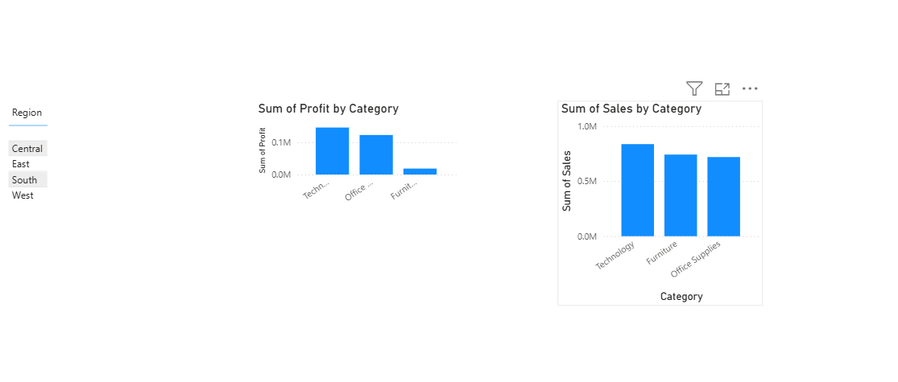

# E-Commerce Performance & Profitability Insights Dashboard

## Project Overview
This project delivers an end-to-end business intelligence solution designed to audit corporate sales data, safeguard reporting integrity, and surface critical profitability anomalies for executive decision-making.

## Interactive Dashboard Preview

## Tech Stack
* **Data Cleansing & Hygiene:** Microsoft Excel
* **Business Intelligence & Visualization:** Power BI Desktop

## Key Steps Executed
1. **Data Quality Audit:** Conducted structural data scrubbing on a raw retail dataset. Identified and permanently removed 17 duplicate transaction rows to prevent top-line revenue inflation and protect reporting alignment.
2. **Interactive Schema Design:** Imported the normalized dataset into Power BI, establishing localized dimensional filtering via dynamic region slicers.
3. **Visual Analytics:** Designed synchronized KPI metrics, horizontal sales tracking, and vertical profitability charts to evaluate performance side-by-side.

## Critical Business Insights Uncovered
* **The Furniture Disconnect:** While cross-visual analysis confirmed that the **Furniture** segment serves as a premier driver of top-line revenue (ranking #2 in overall sales volume), it simultaneously registers an exceptionally thin profit margin. 
* **Strategic Recommendation:** Management should re-evaluate the operational and supply chain overhead associated with the Furniture category, as high-volume moving parts are currently generating negligible bottom-line returns compared to high-margin segments like Technology.
